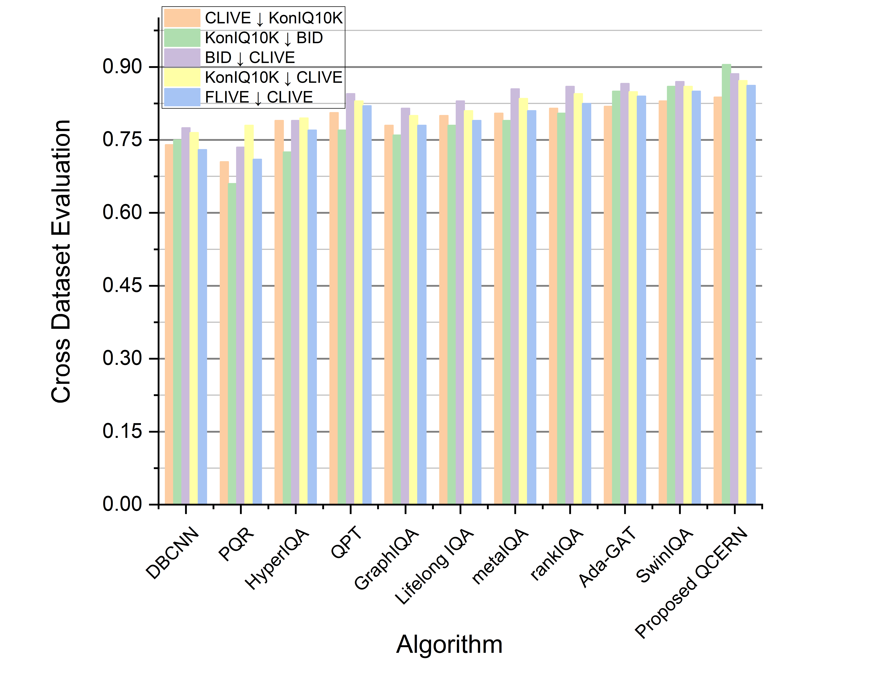
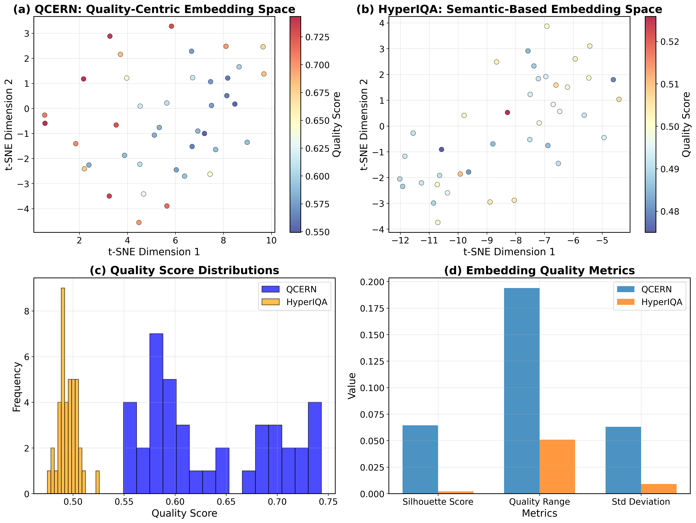
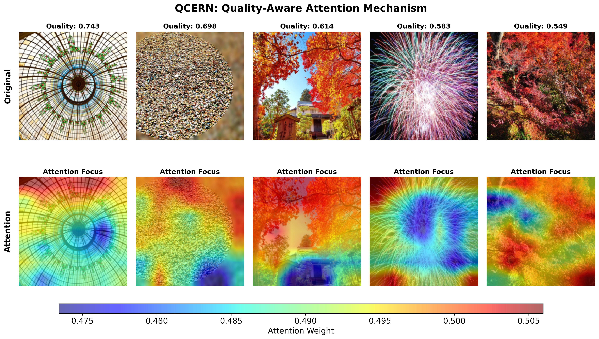

# Quality-Centric Embedding and Ranking Network (QCERN)

<p align="center">
  
  
</p>

<p align="center">
  
  
  
</p>

Official PyTorch implementation of **"A Comprehensive Approach for Image Quality Assessment Using Quality-Centric Embedding and Ranking Networks"**, published in **Pattern Recognition** (Volume 173, May 2026).

📄 **[Paper](https://doi.org/10.1016/j.patcog.2025.112890)** | 🌐 **[ScienceDirect](https://www.sciencedirect.com/science/article/pii/S0031320325015535)**

---

## 📰 News

- **[2026.01]** Code released!
- **[2025]** Paper accepted at Pattern Recognition (Elsevier)!

---

## 📋 Abstract

This paper presents a new technology that focuses on **Blind Image Quality Assessment (BIQA)** through a framework known as **Quality-Centric Embedding and Ranking Network (QCERN)**. Unlike contemporary BIQA techniques that focus solely on regressing quality scores, QCERN features a well-defined embedding space where picture quality is both **clustered** and **ordered**. The model utilizes several **Adaptive Ranking Transformers (ARTs)** along with **dynamic score anchors** representing images of equivalent quality. Multiple loss functions (Order Loss, Metric Loss, Center Loss, MAE Loss) ensure images are positioned correctly according to their quality while maintaining distinct quality divisions.

---

## ✨ Highlights

- 🔹 Novel QCERN framework clusters and ranks image quality effectively
- 🔹 Incorporates Order, Metric, and Center Loss for precise alignment
- 🔹 Demonstrates superior generalization across diverse datasets
- 🔹 Offers applications in photography, medical imaging, and surveillance
- 🔹 Utilizes dynamic score anchors for improved accuracy and adaptability

---

## 🏗️ Architecture

<p align="center">
  
</p>

**Figure 1**: Overview of the proposed QCERN model. The Encoder processes input images along with Score Pivots (P). These are refined through three ARTs to output refined feature vectors and updated score pivots.

### Key Components:
- **Feature Extraction Module**: ResNet-50 backbone pretrained on ImageNet
- **Quality-Centric Embedding Space**: Score pivots as learnable centroids for quality levels
- **Adaptive Ranking Transformers (ARTs)**: Three transformer layers for progressive refinement
- **Loss Functions**: Order Loss, Metric Loss, Center Loss, MAE Loss

---

## 📊 Results

### Intra-Dataset Performance

| Dataset | SRCC | PCC | Kendall's Tau | RMSE |
|---------|------|-----|---------------|------|
| BID | **0.916** | **0.899** | **0.922** | **0.129** |
| CLIVE | **0.923** | **0.913** | **0.912** | **0.130** |
| KonIQ-10K | **0.955** | **0.963** | **0.944** | **0.130** |
| SPAQ | **0.942** | **0.945** | **0.955** | **0.128** |
| FLIVE | **0.665** | **0.760** | **0.927** | **0.125** |

### Cross-Dataset Performance

<p align="center">
  
</p>

### Qualitative Results

#### t-SNE Embedding Visualization
<p align="center">
  
</p>

**Figure**: QCERN demonstrates clear quality-based clustering (left) vs HyperIQA's semantic-based clustering (right).

#### Attention Visualization
<p align="center">
  
</p>

#### Ranking Comparison
<p align="center">
  
</p>

---

## 🗂️ Project Structure

```
QCERN/
├── inference.py              # Main inference and visualization script
├── requirements.txt          # Python dependencies
├── README.md                 # This file
├── 40 Images/                # Sample test images
│   └── 40 Images/
└── Results_figures/          # Generated result figures
    ├── fig1.png              # Architecture diagram
    ├── fig2.png              # Detailed architecture
    ├── fig3.png              # Cross-dataset comparison
    ├── embedding_comparison.png
    ├── attention_analysis.png
    ├── ranking_comparison.png
    └── Cross_dataset_amin.png
```

---

## ⚙️ Installation

### Requirements

- Python 3.8+
- PyTorch >= 1.9.0
- CUDA (optional, for GPU acceleration)

### Setup

1. **Clone the repository:**
   ```bash
   git clone https://github.com/sareerulamin/image-quality-assessment-.git
   cd image-quality-assessment-
   ```

2. **Create virtual environment:**
   ```bash
   # Using conda (recommended)
   conda create -n qcern python=3.8
   conda activate qcern
   
   # Or using venv
   python -m venv venv
   source venv/bin/activate  # Linux/Mac
   .\venv\Scripts\activate   # Windows
   ```

3. **Install dependencies:**
   ```bash
   pip install -r requirements.txt
   ```

---

## 🚀 Usage

### Quick Start

```bash
python inference.py
```

This will:
1. Initialize QCERN and HyperIQA (baseline) models
2. Load test images from `40 Images/40 Images/` directory
3. Extract quality-centric embeddings and quality scores
4. Generate visualization figures (embedding_comparison, attention_analysis, ranking_comparison)

### Using Custom Images

Place your images in the `40 Images/40 Images/` directory. Supported formats: `.jpg`, `.jpeg`, `.png`

### GPU Support

The script automatically detects and uses CUDA if available:
```python
device = 'cuda' if torch.cuda.is_available() else 'cpu'
```

---

## 📈 Benchmark Datasets

QCERN is evaluated on five benchmark BIQA datasets:

| Dataset | Images | Description |
|---------|--------|-------------|
| **BID** | 586 | Blur and noise distortions |
| **CLIVE** | 1,162 | Camera in the wild, indoor/outdoor |
| **KonIQ-10K** | 10,073 | Large-scale crowdsourced quality |
| **SPAQ** | 11,125 | Smartphone image quality |
| **FLIVE** | 40,000+ | Flickr real-world images |

---

## 📝 Citation

If you find this work useful for your research, please cite our paper:

```bibtex
@article{haider2026comprehensive,
  title={A comprehensive approach for image quality assessment using quality-centric embedding and ranking networks},
  author={Haider, Zeeshan Ali and Amin, Sareer Ul and Fayaz, Muhammad and Khan, Fida Muhammad and Moon, Hyeonjoon and Seo, Sanghyun},
  journal={Pattern Recognition},
  volume={173},
  pages={112890},
  year={2026},
  publisher={Elsevier},
  doi={10.1016/j.patcog.2025.112890}
}
```

---

## 👥 Authors

| Author | Role |
|--------|------|
| **Zeeshan Ali Haider**<sup>1</sup> | Conceptualization, Visualization, Methodology, Writing |
| **Sareer Ul Amin**<sup>1</sup> | Conceptualization, Visualization, Methodology, Writing |
| **Muhammad Fayaz** | Visualization, Writing – review & editing |
| **Fida Muhammad Khan** | Visualization, Writing – review & editing |
| **Hyeonjoon Moon** | Writing – review & editing |
| **Sanghyun Seo** | Supervision, Conceptualization, Writing – review & editing |

<sup>1</sup> These authors contributed equally to this work and share first authorship.

---

## 🙏 Acknowledgments

This work was supported by:
- National Research Foundation of Korea (NRF) grant funded by the Korea government (MSIT) (No. RS-2023-00218176)
- Culture, Sports and Tourism R&D Program through the Korea Creative Content Agency (KOCCA) grant funded by the Ministry of Culture, Sports and Tourism (MCST) in 2023 (Project Number: RS-2023-00227686)

---

## 📄 License

This project is licensed under the [Creative Commons Attribution-NonCommercial 4.0 International License (CC BY-NC 4.0)](http://creativecommons.org/licenses/by-nc/4.0/).

---

## 📧 Contact

For questions or issues, please open an issue on GitHub or contact:

**Sareer Ul Amin**  
📧 Email: [sareerulamin320@gmail.com](mailto:sareerulamin320@gmail.com)  
🐙 GitHub: [@sareerulamin](https://github.com/sareerulamin)

---

<p align="center">
  <b>⭐ If you find this work useful, please consider giving it a star! ⭐</b>
</p>
